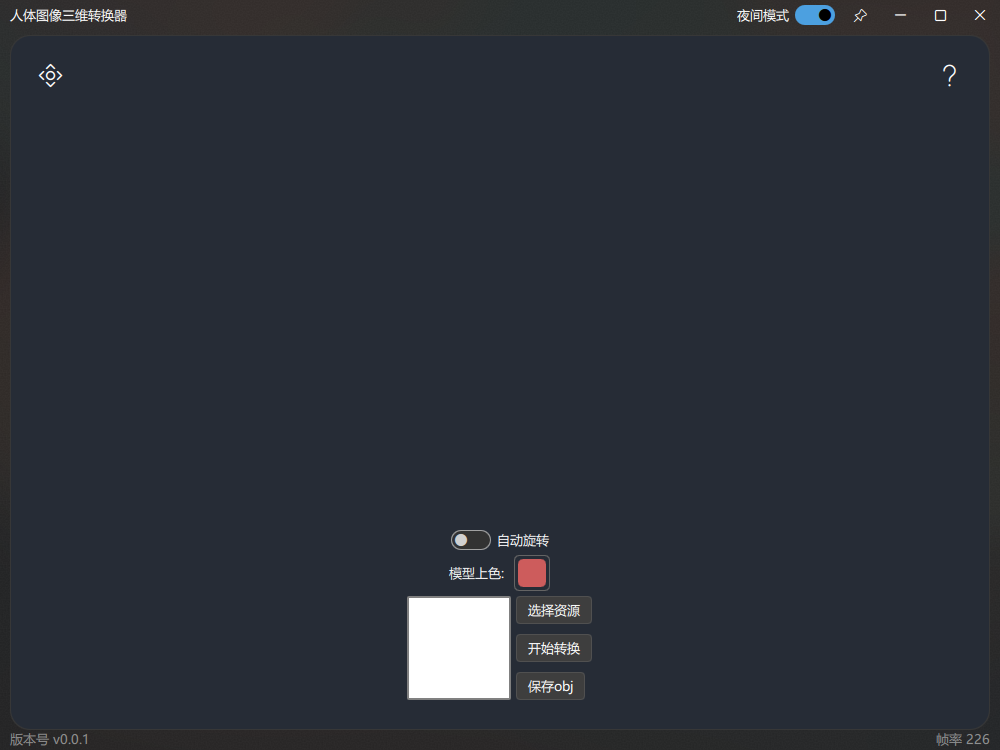
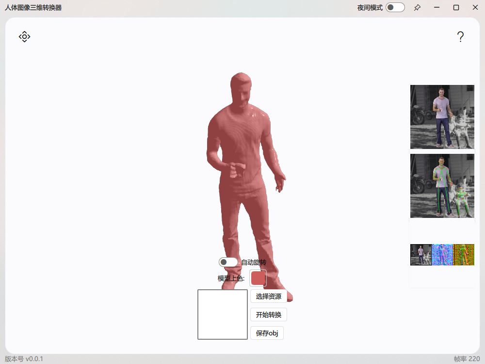
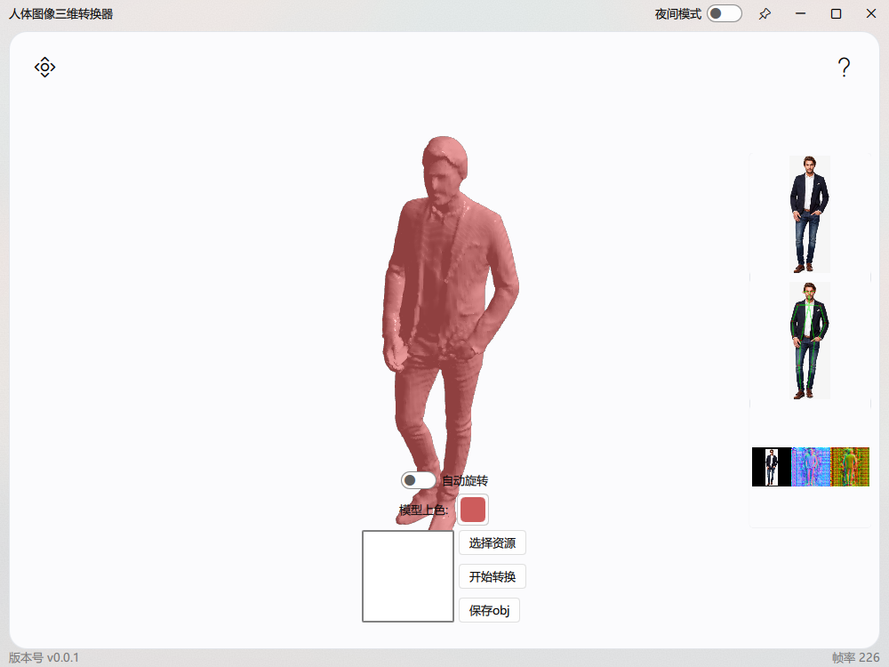

# FluentViewer
--- ---
### 简介
* 通过输入二维人物图像即可生成三维mesh
* 程序支持本地查看mesh
* 其他功能...
---
### 部分截图

---

---

---
### 鸣谢
* https://github.com/Daniil-Osokin/lightweight-human-pose-estimation.pytorch
* https://github.com/facebookresearch/pifuhd
* https://github.com/zhuzichu520/FluentUI